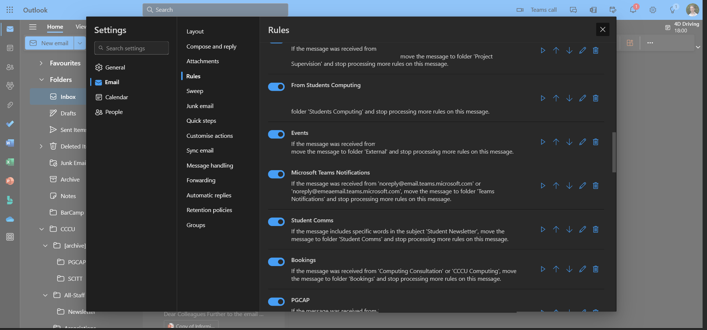
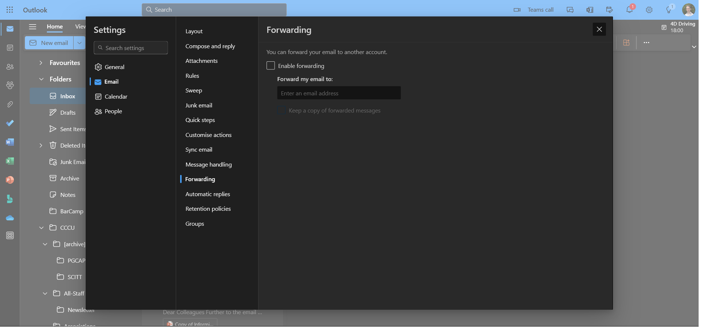

Course Mechanics (1 hour)
================

Mechanical overview. Sorry, this is very one-way and will not be overly interactive.

Student rep
-----------
We need to elect one in SP3 (next week).

Documentation
-------------

### Blackboard

* [BlackBoard - https://learn.canterbury.ac.uk/](https://learn.canterbury.ac.uk/)
    * [Secondary Student Teachers](https://learn.canterbury.ac.uk/ultra/courses/_23668_1/outline)
        * Course Handbook
    * [Subject Pedagogy](https://learn.canterbury.ac.uk/ultra/courses/_23714_1/outline)
        * Computing Curriculum Guidance 2022

### Core Documents

Find them? Where? How?

* ePortfolios
    * "All Documents"
        * [OneNote SD 23/24 (ReadOnly)](https://cccu-my.sharepoint.com/:f:/g/personal/sm1161_canterbury_ac_uk/Eg339CoktNZOsWIF9RQyu8ABPb1axqBqnpVzEfds_9a5cQ)
        * [OneNote PGCE 23/24 (ReadOnly)](https://cccu-my.sharepoint.com/:f:/g/personal/sm1161_canterbury_ac_uk/EpSlUNPf7uxPvIaXNgbESyUBd_MHoNDpymTBSxGIOskLXw)
    * Course Information
        * Course handbook
        * Curriculum Guidance

TASK: Load up the curriculum guidance
How can this be used with your mentor

### BlackBoard Collaborate

* Finding sessions
* Finding recordings

Assessment
----------

* Teaching Portfolio (ePortfolio)
    * A Single repository to reference/archive - ePortfolio
        * Available on request to external examiner
    * Mentor Meeting notes
        * Evidence for every week
    * Lesson Packs
        * 1 Lesson pack ==
            * Lesson plan
            * Lesson observation
            * Lesson Evaluation
        * 20(?) are required (one a week from DTP?)
    * _Bundles_ (2 required)
        * Covering two key stages KS3? KS4? (year 9 doing gcse DO NOT COUNT)
        * Lesson packs
        * Examples of pupil work
        * Feedback -> Actioned
        * Us of data
        * Reflections
    * Subject Knowledge Tracker and evidence of progress (more about this later)

Course
------

### Interruptions and Withdrawals

* I am not allowed to give financial advice
    * Withdrawing before christmas has less financial impact than after
* Withdrawals VERY bad for us - interruptions are much better

### The path to QTS

* ITT Year (PGCE/SD)
    * [Initial teacher training (ITT): core content framework](https://www.gov.uk/government/publications/initial-teacher-training-itt-core-content-framework)
        * [[CCF]]
* ECF Year (Next year in school)
    * [early-career-framework](https://www.gov.uk/government/publications/early-career-framework)
    * early-career-framework [Core induction programme](https://www.early-career-framework.education.gov.uk/)

### Course Requirements

* Experience teaching 4 year groups
    * Across two key stages
* In 2 Schools
* With 120 Days teaching

### Programme Structure

P1 = Placement 1
P2 = Placement 2
CTP = Collaborative Teaching Phase
DTP = Developing Teaching Phase
ITP = Independent Teaching Phase
SPR = Student Progress Review

|        | Term1 | Term2 | Xmas | Term3 | Term4 | Easter | Term5 | Term6 |
|--------|-------|-------|------|-------|-------|--------|-------|-------|
| Phase  | CTP   | CPT>DTP|     | DTP   | DTP>ITP|       | ITP   | ITP   |
| SD     | Base  | Base  |      | Contrast| Base |       | Base  | Base  |
| PGCE   | P1    | P1    |      | P1    | P2    |        | P2    | P2    |
| PGCE Coursework | SP1 | SP2 | | REE   | REE   |        | PP    | PP    |
| SPR    |       | SPR1 |       | SPR2  |       |        | SPR3  | SPR4  |

PGCE: 20 Session (6 hours per session) = 120 hours
SD: 14 Sessions = 84 hours (-14hours admin and surveys and folders) = 70hours

SD == 70% of Session time that PGCE have

* PGCE: I write your reference
    * (You probably want a school mentor as a second?)
* SD: Your school writes your reference

### CTP, DTP, ITP

1. Collaborative Teaching Phase
2. Developing Teaching Phrase
3. Independent Teaching Phrase

Placement 1: CTP + DTP
Placement 2: ITP (but need to get up to speed with new context)

|Phase|Dates | School days per week |Solo teaching |Collaborative teaching|Observation|Professional activities|
|-----|------|----------------------|--------------|----------------------|-----------|-----------------------|
| Collaborative Teacher Phase (CTP) | 2nd Oct – 27th Oct:| See Guidance Below for Induction, tasks, activities and teaching|
| Intensive Training and Practice (ITAP)| 30th Oct – 2nd Nov | 3 | 0% | 30% |60% | 10%
|Development Teaching Phase (DTP)| 6th Nov – 15th Dec: | 4 |10% |30% |20% |40% 
|DPT|2nd Jan – 8th Feb: |4 |40% |20% |10% |30% 
|Induction Days, Independent  Teaching Phase (ITP)|4th Mar – 8th Mar:  |4 |0% |20% |45% |35% 
|ITP|11th Mar – 3rd May: |4 - 5 |40% |15% |15% |30% |
|ITP|7th May – 27th  Jun:|4 - 5 |50% |10% |10% |30%  |

Subject Session
---------------

### Weekley Subject Targets Starter

* Every session (target overview - pair catchup) 15min

### Attendance - beep cards
* I will start at 9:00
* 9:15 Late
* No card - nothing I can do
* I will keep my own records

### Absence From Subject Sessions
* 5 days == Letter
* 120 days required in school
* missed session 500 words
    * reflective piece on key question
    * NOT a punishment
    * NOT an alternative to attending sessions
* missed session == not meet teaching standards (part2 professionalism)

### Action: Learning Support Plan (LSP) (if needed)
* You need to request this through student support services - this is student activated
* Any disability or mental health issue can be identified

Temporary if needed (TLSP)

### Placement Support Plan (PLSP)

Temporary

### Student Progress Reports - Review Points

You lead the assessment!

* SPR1 28th November to 16th December
* SPR2 9th January to 8th February
* SPR3 20th March to 28th April

### Extensions to Assignments

* Student initiated to admin team
    * Self certification request (14 days before deadline)
    * Evidence based request (up to 7 days after deadline)

Placements
----------

### Weekley Mentor Meeting

* Put first weekley meeting sheet in ePortfolio
    * With reflections from today

* Targets - join the dots (last week -> this week -> next week)
* lead by you! - discussed with mentors - SMART targets
* mentoring (term1) -> coaching (term2)

TASK: What is the difference between mentoring and coaching

Session notes on weekley meetings - actions?
* Discuss your weekley targets and reflections with peer at beginning of each session (15min)
* End of session - TODO's, Action points, Reflections (15min)

### Absence from School
* inform ahead 
    * Unless you have been incapacitated please communicate in advance
* report formally after - Use the reporting form
* Attending punctually is the expectation for someone who is training to "have the legal responsibility to supervise 30 young people at 8:40am each morning"

### Transport to placements

It is your responsibility to get to your placement school

* Public transport (+ folding bike)?
* Contact other students that are going to that school
    * TODO: Can CCCU assist by facilitating students contact at the same school?
* On arrival at school: contact other staff from your area
* Invest in transport Motorbike/Car/FoldingBike
* Worst case: Rent B&B or other accommodation during the week.

sidenote: we have one schools accepting Computing placements in Canterbury. One possible cause was conduct of previous PGCE students. Your relationship with your school has a wider impact than just you.

Tutor Role
----------

### My Role

* QA Mentors (I visit the mentors, not you)
    * NOT assess you teach
        * I can observe you teach to help support your mentor
* Support you - PAT
* Mark academic assignments (PGCE)
* Assess folders at end
* PGCE
    * Write your reference
* SD
    * Final assessment
* Verify your ePortfolio before recommending QTS

### My Role as course tutor (the reality)

* My goal is to support you become a successful teacher.
* I will do everything I can to help you _succeed_.
* Some of the things I do you may not _like_, but they are to help you be successful.

* Targeted Support Action Plan
    * Professional communication (to me or between each other)
        * > 8.3 ... supporting and developing effective professional relationships with colleagues.

* I'm kind of your line manager
* BUT you hold all the power
    * You fill in the exit survey of your experience of the course

Tools
-----

### Notes about tooling

* Do not suffer data-loss.
    * Use the right tools.
    * There will be little excuse for you as Computing professionals to loose data.
    * Dropbox, OneDrive, GoogleDrive, Google Docs, Microsoft Office 365

* Use Styles
    * If I ever see anyone changing the size of a font freehand in a document or slideshow, I will loose my ****!

### Recording Sessions

* Session recordings
    * If we record a 7 hour video
        * This is hard to access/find/seek information
        * It discourages some people to participate because it will be set in stone
    * I will record segments of sessions
* The _YouTube_ effect - the bar of _Professional Content Creators_
    * We are all exposed to exceptionally high quality online videos
        * Pro video equipment, lighting, editing, scripting, info-graphics
* Our videos from our session are not designed to be online _professional content_. They are reminders for us.
* In reality - it is hard to extract meaningful information from a video

### Handling the tidal-wave of Communication

* https://outlook.office.com/
    * Setup email rules
        * 
    * Setup account as a _forwarding account_?
        * 

* Complaints in the past that communication has been fragmented, late or mistimed
* Lots of moving parts
    * Tutor, School Mentor, Uni Admin, Uni Program Directors, Other Students, School Admin, Enhancing Pedagogy Tutor
* I am not on the same email lists as you (This is being discussed/rectified)
* If the global communication you receive is less then ideal ...
    * Do not panic - calm down!
    * Communicate concerns clearly to you PAT
    * You will not be penalised un-duely or unfairly

Wider Success
-------------

### Your choice of language

* This shapes how you think about yourself and your relationship with others.

TASK: Think, Pair, Share - 
* Consider the terminology/language you will use to refer to 
    1. The "the smaller humans that you teach"
    2. Academic performance of a smaller human

TASK: In your ePortfolio - make a reflection point to ...
* Observe/Identify/Comment/reflect on the language that colleagues in school use
* #1/b-HighExp-LearnHow-consistent_language

(even at home and among friends)

* Some thoughts
    * Children (<10?)
    * Kids?
    * Young People
    * "Low _ability_" !!!?!!
        * "Low attainment"
    * (Verbal) You _Just_, _Simply_ (Don't trivialise)
    * Unneeded words: Um, So, Ok, Just, Basically, Simply
    * Differentiation ("DIFFERENT") -> Adaptive/Adaption
* Action Point
    * Listen to the language the professionals use around you
    * Make notes on phrases you hear
    * (Specific Focus of observations)

### Judging other teachers

* You simply do not know enough about the role to make a judgement on other teachers
* Bite your tongue
* The education you observe WILL be different from your personal experience of education. You are a sample-size of 
    * There are millions of different classrooms. You don't know.

### Be a _net positive_

* Your presence in a school as a trainee will drain a lot of time and energy from the other staff. 
* Be mindful of them
* Consider how you can reduce how much you take and maximise how much you contribute

### Professionalism

See my Sessions on 
* [_firstProfetionalRole.md](./_firstProfetionalRole.md)
* How to be an Effective Colleague

### Peer Communication

* Previous years:
    *  The Computing groups were supportive to each other. They had a WhatsApp group and formed a great peer support network and are still friends today.
* Previous years:
    * Was a cataclysmic clash of characters that antagonised each other and there was friction with "Who kicked Who from the group". 
    * Group work in sessions was limited. 
    * This was a difficult year for everyone.
* This year:
    * When you communicate with each other you communicate as professionals. Do not expect everyone to be _your friend_
    * You can setup informal communications between each other on the expectation that you can function like professionals in our subject sessions
    * I will raise professional communication issues with you formally and quickly.

* To Jest and highlight the differences
    * DOTA, Fortnight, So Woke, YOLO, The Quest2 is da shit
    * Mortgage, Car, I have knowledge far beyond your comprehension as I have a child and have achieved true enlightenment but I suffer the eternal burden of childcare.

### What do people struggle with (on this course)

Your answers

* Misaligned expectations
    * Masters Level - Not 'tips for teaching', no 'tick-list'
* Social Awareness/integration
    * Part2 of Teachers' Standards
* Renegotiate identity
* Previous Teaching Confidence
    * If you've taught in other contexts/countries this WILL be different
* Fear
    * (Read Chaucer Letter)
    * Be responsive to feedback
    * Please don't consider me "The Threat"
        * I may have to engage with the difficult conversations

[//begin]: # "Autogenerated link references for markdown compatibility"
[CCF]: national_documentation/CCF.md "Core Content Framework"
[//end]: # "Autogenerated link references"