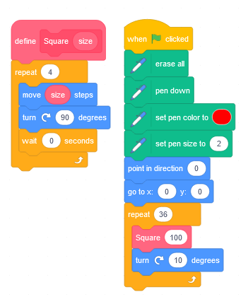

Demo Shapes - Context
=====================

Practical Exploration (30min)
---------------------

* [](https://www.cambridge.org/core/books/cambridge-handbook-of-computing-education-research/pedagogic-approaches/6B64002A4E73841A01F32EB1C17E7DE6)
    * > Media computation is a pedagogic approach for teaching introductory programming whereby manipulation of media, such as digital images and sounds, is used as a context to teach programming concepts.

* Part1: Explore 3 shape drawing tools (30min)
    * Scratch, Python-Turtle, Javascript-Canvas
    * (Depending on your confidence/skill level - TimeBox each of these tools)
        * Javascript is optional

#### Scratch

* https://scratch.mit.edu/
    * 

(Can't fill shapes in scratch)

#### Python 'Turtle' Graphics

[turtle](https://docs.python.org/3/library/turtle.html) documentation

* local machine? (IDLE 3.xx 64-bit)
* https://create.withcode.uk/
* https://repl.it/ (account required)

```python
import turtle
t = turtle.Turtle()
t.forward(100)
```
```python
def example_function(a, b):
    t.fd(a)
    t.rt(b)
    t.fd(a)
    t.rt(b)

example_function(10,20)
```

<details>

Draw a square - see the repetition - use a loop

```python
def sides(sides, size):
    for i in range(sides):
        t.rt(360/sides)
        t.fd(size)
```
</details>

#### Javascript Canvas

* [graphics.html](https://github.com/calaldees/TeachProgramming/blob/master/teachprogramming/static/projects/game/graphics.html) 
    * HTML Boilerplate


#### TASK: Task Generation

Now you have a crude understanding of the drawing tools...
Deep end!

* TASK:
    * (5min) Individual - Devise a sequence tasks for students
    * (5min) Pair - Confer/Compare (describe 'why' you structured/sequenced the tasks in that way)
    * (5min) Pair - Collaborate on improvements to your tasks/sequence ('why' are you making those changes)

Meta: If I tell you a list of tasks, it won't be as impactful - I need you to wrestle with the problem to get maximum impact of my ideas later.

<details>

* Tasks
    * A function to draw (Guided Training)
        * Square
        * Triangle
        * Hexagon
        * A function to draw a shape of "number of sides"
        * Fill the shape?
    * Personal exploration? Attempt to build a function that draws ...
        * House?
        * Snowman?
        * Tree? (filled circles or triangles)?
        * [Compute-IT CPD Video Lessons: Sample Resource 3](https://www.youtube.com/watch?v=A0rxQnxEdiI&list=PL_8st1egDh7av261LnYKAe1guRlM1M9eB&index=3)
        * (More on my slant on this later)
            * The above task is cognitively interesting and creative - but is not overly a good task
    * Decompose artwork - see below
    * Marking Criteria?
    * Animate/Move the shape - draw/clear/draw
        * `turtle.tracer(n=None, delay=None)`
        * `clearscreen()`
        * `sleep(1)`


</details>


Context Based Learning and Relevancy (15min lecture)
------------------------------------

If Computing is to be relevant to world they live in, then make Computing encompasses the world. Wherever possible make Computing have _Cultural_ and/or _Community_ context

Young people can smell bullshit.
Things I try to avoid:
* Fake themes
    * Harry potter tuck shop spreadsheets
    * Ponies
* Try to avoid computer games as a theme
    * These can alienate some demographics immediately
    * > Games are pointless, they don't do anything (for the world)
* Tasks for the sake of a task
    * "Add these number together", "Why", "Because it's the task"
    * (This is less of a problem for A-Level as they have chosen the subject)


* [Pete Dring](https://twitter.com/pddring/status/1405890060013146118)
    * > So proud of Holly and Kiri from @fulfordschool
      > who have just submitted their #MentalHealth app for the @AmazonUK
      > #LongitudeExplorerPrize. Can you spare a minute to vote for LESLI in the people's choice award? https://longitudeexplorer.challenges.org/vote/ 
      > #STEM @Stemettes #Tech4Good #CASChat
    * [longitudeexplorer.challenges.org/finalists-2021](https://longitudeexplorer.challenges.org/finalists-2021/)
        * Living Better: How can technology to help us stay happy and healthy in our day to day lives, and improve the lives of others?
        * Living Greener: How can technology help us protect our planet?
        * Living Together: How can technology help us live together and stay connected in a way that is easy, safe and environmentally friendly?
        * Living Longer: How can technology meet the needs of an ageing society?


### Real World Context for the Pen/Turtle/Graphics skills learnt above
* Decomposition of geomentirc artwork - cultural context
    * [Theo van Doesburg](https://www.google.com/search?q=Theo+van+Doesburg&tbm=isch) (artist using geometric squares and lines)
    * [Simple Celtic artwork](https://www.google.com/search?q=simple+celtic+artwork&tbm=isch) (circles)
    * [Simple Islamic artwork](https://www.google.com/search?q=simple+islamic+artwork&tbm=isch) (repeating geometric patterns/colors)

By adding context you immediately unlock further computational thinking skills: analysis, decomposition, algorithms

* This concept from Compute-IT Hodder Education
    * [Student’s Book 1](https://www.hoddereducation.com/media/Documents/ICT/801921-Compute-IT-sample-pages_1.pdf)
    * see [[text-books]]


### Relevancy/Context Reading

* [Top 12 Ways to Bring the Real World into Your Classroom](https://www.teachhub.com/classroom-activities/2010/05/top-12-ways-to-bring-the-real-world-into-your-classroom/) 2010 K12 USA
    * Invite guest speakers
    * Developing empathy for others (societal)
    * Current events, Use the news
    * Social justice (standing up for what is right. peacefully protest)
    * Field trips
    * Manners and etiquette
    * Finance training (understand basic societal economics) classroom economy?
    * Primary source documents
    * Simulate a real-world experience
    * Community work
    * Life skills
* 3P Learning [Connecting Science Class to the Real-World](https://www.3plearning.com/blog/connecting-science-class-real-world/) 2019 

TASK: Now we have explored the skills and the context. Refer back to the Compute-IT teaching resource examples

### Examples
* [Locked-in syndrome](https://teachinglondoncomputing.files.wordpress.com/2014/01/activity-lockedin.pdf) activity disabled people communicating with blinking


SSDD
----

* [[ssdd]] Same Surface different depth 

Imagine creating resource for topics in computing that have resources/plan for KS2 though to KS5.
The Scratch, Turtle, Canvas example was one
Boolean Logic -> single 'if' though to 'and/or' though to simplifying logic (demorgans)


Putting it all together
-----------------------

TASK: Design a sequence of lessons using computers to make shapes
Lessons: 3? to 8? Probably 6 (a half term)
* What are your learning objectives
* What is your rough timeline
* How are you going to leverage
    * Meta-cognition
    * Adaptions
    * Assessment


<details>

My unstructured notes - some ideas

#5/4-AdaptTeach-LearnThat-no_separate_tasks_ssdd
SSDD - Same Surface, Different Depth
Differentiation works best when class's are not working on unrelated tasks
#5/h-AdaptTeach-LearnHow-no_separate_tasks_ssdd

* Goal
    * To recreate algorithmically the artwork of a culture or artist
* Technical Goal(s)
    * A reusable function/subroutine to create a shape
        * that takes parameters for size and number of sides
    * Compose a new shape from multiple shapes
* Knowledge goal(s)
    * Understand the concept of (but maybe not do) recursion - drawing a smaller shape within a shape

* Meta
    * What can I already do
    * What am I aiming for? What could be a step towards that aim (even if it's small)?
    * Where can 'I' find more information/support on xxx


* Peer mark
    * 2x
    * Teacher moderates each marker and gives feedback to marker
    * Practice run to ensure everyone knows what they are doing
* Peer assessment criteria (for peer verbal presentation) 
    * Tools
        * Function
        * Parameters
        * Iteration
        * Recursion?
    * Decomposition
        * What shapes did you identify
        * How did re-create them
        * Use of documentation/reference
    * Meta
        * What bits was I able to solve myself - what bits did I need help with
        * What improvement could you make in future
        * What real life jobs would use these skills

</details>


[//begin]: # "Autogenerated link references for markdown compatibility"
[text-books]: text-books.md "Text Books"
[ssdd]: ssdd.md "Same Surface - Different Depth"
[//end]: # "Autogenerated link references"