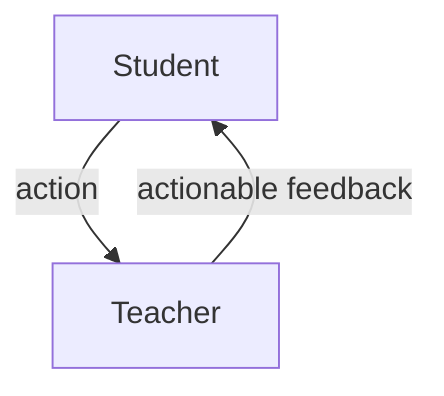

Feedback Cycle and Tools (30min)
------------------------

* See
    * [[feedback-verbal]]
    * [[feed_forward]]
    * [[feedback-whole-class]]

### Make Students Think

* Below are a list of general feedback and marking techniques that prompt students to engage with the feedback
* Read (7min)
* [10 Feedback Techniques That Make Students Think](https://www.dylanwiliamcenter.com/wp-content/uploads/sites/3/2015/02/10-Feedback-Techniques.pdf) Dylan Wiliam 2015
    1. Marking for improvement
        * When grading student work, record a grade in your grade-book, but only give students written comments on how to improve. Give students time to read the comments in class and one week to resubmit the work. The final grade is the average of the first and resubmitted grade.
    2. Mastery marking
        * Only accept student work when it is of a specific quality. You might only give one grade, an A. Students are expected to continue to redraft and resubmit their work as many times as necessary in order to achieve an A. The overall grade is then determined by the number of As.
    3. +, –, = (Plus, Minus, Equals) 
        * Mark student work in relation to previous work. If the latest work is of the same quality as the last, it receives an ‘=’, if it is better than the last, it receives a ‘+’, and if it is not as good as the last, it receives a ‘–‘. 
    4. Responding to marking
        * Write your teacher feedback, signed and dated, at the start of the exercise book. Students then make an appropriate response below the teacher feedback, including where to find any redrafting. Do not mark the next piece of work until the student has responded to the last feedback provided.
    5. Focused marking
        * Mark student work against one or two specific criteria, even though there may be many criteria that could be marked. This allows you to provide more focused and detailed feedback on these criteria than if everything was marked. The grade-book contains the skill marked rather than the title of the work set.
    6. Find and fix your mistakes
        * Instead of marking answers as correct or incorrect, tell the students the number of answers that were wrong. Give them time in class to find and correct their mistakes, either individually or in groups.
    7. Margin marking
        * Instead of marking each spelling or grammar mistake on essays, place a mark in the margin. Students then find their own mistakes and correct them
    8. Traffic lights
        * Give students a RED, AMBER or GREEN mark for a piece of work. All RED and AMBER work can be redrafted in an attempt to achieve a GREEN mark. The final grade is calculated from the number of GREEN and AMBER marks
    9. Aim for the next level
        * Students identify areas of improvement by comparing their work to exemplars at the next level of achievement. Students realize that they need to set themselves higher standards. Able students find that they can improve a good piece of work.
    10. Match comments to work 
        * Write comments about students’ work on strips of paper without names. Sit students in groups of four. Each group of four students gets back their four pieces of work and their four comments. The group needs to decide which comment goes with which piece of work.

Consider the question below
* Most of these examples are about a student having a paper workbook (some computing teachers do this!)
    * Can you describe an example of any of these that map to the context of teaching Computing in a digital/remote classroom?

### Feedback Loop/Cycle

* Teacher needs to actively monitor work
    * Students need to know that you care about the work (if you don't care, why should they care)
* Teacher give actionable feedback
* Students needs to digest and then action
* Teacher identify that action has been taken based on the feedback

Show you care - two way process

### Discuss tooling and workflows (15min)

* In the context of the modern Computing classroom - how would we accomplish this 'feedback cycle'?
    * How do we quickly comment on students code? and quickly see their progress?

* TASK: What tools could be used to:
    * facilitate this feedback exchange?
    * record this feedback exchange?
    * facilitate the feedback exchange in a timely manner?
        * provide alerts?
* I've got some ideas ... I'm interested to hear yours
    * git? 
        * (anonymous?, comments, script assisted)
    * [repl.it](https://replit.com/site/teams-for-education)
        * https://replit.com/curriculum/Intro-to-Python
    * physical workbook?

[//begin]: # "Autogenerated link references for markdown compatibility"
[feedback-verbal]: feedback-verbal.md "feedback-verbal"
[feed_forward]: feed_forward.md "feed_forward"
[feedback-whole-class]: feedback-whole-class.md "Feedback - Whole Class"
[//end]: # "Autogenerated link references"