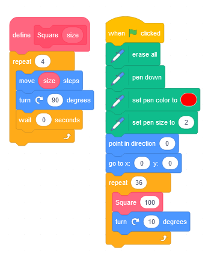

Planning
========

### Objectives

* What, and how, has teaching and learning of subject been affected in this area/my placement school?
* What are current subject practices?
* What are the skills of reasoning and problem solving in Computer Science and how are computing departments addressing these?
    * Anticipating common misconceptions; a tool to aid learning
* Planning for progression - Schemes of Work - Building schemata
    * Pupils learn new ideas by linking those ideas to existing knowledge, organising this knowledge into increasingly complex mental models
* Exploring strategies that aid teaching and learning including contextualised, independent, discovery

* Intro (15min)
* Comparing school approaches for progression (1 hour)
* Textbooks for teaching Computing? (45min)
* Practical Exploration (shape tools) (30min)
* Context and Relevancy (30min lecture)
Total 3 hours


Computational Thinking
----------------------

What are the skills of reasoning and problem solving in Computer Science and how are computing departments addressing these?

* Computational Thinking
    * Components
        * Decomposition
        * Pattern Recognition/DataOrganisation
        * Generalisation/Abstraction
        * Algorithms
    * Info
        * [BBC Bitesize](https://www.bbc.co.uk/bitesize/guides/zp92mp3/revision/1)
        * [Wikipedia](https://en.wikipedia.org/wiki/Computational_thinking)
        * [Computational Thinking for a Computational World - digitalpromise.org](http://digitalpromise.org/wp-content/uploads/2017/12/dp-comp-thinking-v1r5.pdf)
        * > When defining what computational thinking is, it is also helpful to establish what it is not: that is, humans thinking like a computer. In fact, it is just the opposite. Computational thinking is a uniquely human ability


Schemes of Work
---------------
Planning for progression - Building schemata

A scheme of work implements a syllabus.
* [Curriculum](https://en.wikipedia.org/wiki/Curriculum) Wikipedia
    * > Curriculum is broadly defined as the totality of student experiences that occur in the educational process.
    * > The term often refers specifically to a planned sequence of instruction, or to a view of the student's experiences in terms of the educator's or school's instructional goals
* [Syllabus](https://en.wikipedia.org/wiki/Syllabus) Wikipedia
    * A syllabus or specification is a document that communicates information about a specific academic course or class and defines expectations and responsibilities. It is generally an overview or summary of the curriculum.
* [Scheme of work](https://en.wikipedia.org/wiki/Scheme_of_work) Wikipedia
    * > the structure and content of an academic course (syllabus). 
      > It splits an often-multi-year curriculum into deliverable units of work,
    * May include
        * Content
        * Objectives or Outcomes
        * Methods of delivery (student and teacher activity)
        * Assessment strategies
        * Resources

In KS3 - 3 Years is a long time - time to forget - revisit topics multiple times over a 3 year period. e.g. Most years have some kind of web work, network work, programming work, etc

Cognitive Load Theory (explored more next session _howStudentsLearn_)
> Working memory should be seen as short term and finite, 
> whereas long-term memory can be seen as infinite. 


### Comparing school approaches for progression (1 hour)

Reminder: 
* KS3 == Year 7 to Year 9 (Level 0 to 1)
* KS4 == Year 10 and Year 11 (Level 1 to 2)

Your familiar with [KS3 Computing National Curriculum](https://www.gov.uk/government/publications/national-curriculum-in-england-computing-programmes-of-study/national-curriculum-in-england-computing-programmes-of-study#key-stage-3)

TASK 1: In pairs, compare the KS3 resources you have acquired from your school. (20min)

Make notes on + be prepared to present
1. How do the topics map to the National Curriculum? (is this specified?)
2. What are the links between topics for year 1, 2, 3?
    * What kind of progression are the creators thinking about?
3. What similarities/differences are there between the schemes of work?

(10min group confer)

TASK 2: Explore other KS3 SOW online (20min)
1. Other than the sequence of content, what other teaching resources are provided?
2. Would you be able to teach any of these units with the resources provided?

(10min group confer)

* [teachcomputing.org: Key stage 3 resources](https://teachcomputing.org/curriculum/key-stage-3/)
    * [Teach Computing Curriculum Journey](https://static.teachcomputing.org/curriculum_journey.pdf)
        * Hundreds of KS3 and KS4 lessons
* [interactiveclassroom.net](https://www.interactiveclassroom.net/?page_id=163)
* [CAS - community contribution](https://community.computingatschool.org.uk/files/5130/original.pdf)
* [KS3 Computing and GCSE Computer Science](https://www.advanced-ict.info/theory/NC/index.html)
    * > buying, or using, someone else's scheme of work makes teachers less effective because they spend less time thinking about the curriculum as a whole, and that teachers and departments that create their own curriculum or scheme of work have more "impact".
    * [KS3 Computing Scheme of Work - Year 1](https://www.advanced-ict.info/theory/NC/scheme_1.html)
    * [KS3 Computing Scheme of Work - Year 2](https://www.advanced-ict.info/theory/NC/scheme_2.html)
* [Compute-IT](https://www.hoddereducation.com/compute-it) Hodder Education - TextBooks
    * See "Samples: Student Book 1" and "Scheme of Work: Compute-IT 1 Year 7"
* [Google: ks3 computing scheme of work](https://www.google.com/search?q=ks3+computing+scheme+of+work)
    * There is a wealth of resources out there! Go and explore!
* [PG Online: KS3 Computer Science](https://www.pgonline.co.uk/resources/computer-science/ks3/) + Curriculum Map
    * 22 downloadable teaching units (samples free)

* [queenelizabeths.kent.sch.uk](http://www.queenelizabeths.kent.sch.uk/249/computer-science) - Look how digital-literacy/ict is interwoven with the computing


<details>

Boost From Hodder Education 
https://boost-learning.com/courses/listing

</details>


Practical Exploration (30min)
---------------------

* [](https://www.cambridge.org/core/books/cambridge-handbook-of-computing-education-research/pedagogic-approaches/6B64002A4E73841A01F32EB1C17E7DE6)
    * > Media computation is a pedagogic approach for teaching introductory programming whereby manipulation of media, such as digital images and sounds, is used as a context to teach programming concepts.

* Part1: Explore 3 shape drawing tools (30min)
    * Scratch, Python-Turtle, Javascript-Canvas
    * (Depending on your confidence/skill level - TimeBox each of these tools)
        * Javascript is optional

#### Scratch

* https://scratch.mit.edu/
    * 

(Can't fill shapes in scratch)

#### Python 'Turtle' Graphics

[turtle](https://docs.python.org/3/library/turtle.html) documentation

* local machine? (IDLE 3.xx 64-bit)
* https://create.withcode.uk/
* https://repl.it/ (account required)

```python
import turtle
t = turtle.Turtle()
t.forward(100)
```
```python
def example_function(a, b):
    t.fd(a)
    t.rt(b)
    t.fd(a)
    t.rt(b)

example_function(10,20)
```

<details>

Draw a square - see the repetition - use a loop

```python
def sides(sides, size):
    for i in range(sides):
        t.rt(360/sides)
        t.fd(size)
```
</details>

#### Javascript Canvas

* [graphics.html](https://github.com/calaldees/TeachProgramming/blob/master/teachprogramming/static/projects/game/graphics.html) 
    * HTML Boilerplate


#### TASK: Task Generation

Now you have a crude understanding of the drawing tools...
Deep end!

* TASK:
    * (5min) Individual - Devise a sequence tasks for students
    * (5min) Pair - Confer/Compare (describe 'why' you structured/sequenced the tasks in that way)
    * (5min) Pair - Collaborate on improvements to your tasks/sequence ('why' are you making those changes)

Meta: If I tell you a list of tasks, it won't be as impactful - I need you to wrestle with the problem to get maximum impact of my ideas later.

<details>

* Tasks
    * A function to draw (Guided Training)
        * Square
        * Triangle
        * Hexagon
        * A function to draw a shape of "number of sides"
        * Fill the shape?
    * Personal exploration? Attempt to build a function that draws ...
        * House?
        * Snowman?
        * Tree? (filled circles or triangles)?
        * [Compute-IT CPD Video Lessons: Sample Resource 3](https://www.youtube.com/watch?v=A0rxQnxEdiI&list=PL_8st1egDh7av261LnYKAe1guRlM1M9eB&index=3)
        * (More on my slant on this later)
            * The above task is cognitively interesting and creative - but is not overly a good task
    * Decompose artwork - see below
    * Marking Criteria?
    * Animate/Move the shape - draw/clear/draw
        * `turtle.tracer(n=None, delay=None)`
        * `clearscreen()`
        * `sleep(1)`


</details>


Context Based Learning and Relevancy (15min lecture)
------------------------------------

If Computing is to be relevant to world they live in, then make Computing encompasses the world. Wherever possible make Computing have _Cultural_ and/or _Community_ context

Young people can smell bullshit.
Things I try to avoid:
* Fake themes
    * Harry potter tuck shop spreadsheets
    * Ponies
* Try to avoid computer games as a theme
    * These can alienate some demographics immediately
    * > Games are pointless, they don't do anything (for the world)
* Tasks for the sake of a task
    * "Add these number together", "Why", "Because it's the task"
    * (This is less of a problem for A-Level as they have chosen the subject)


* [Pete Dring](https://twitter.com/pddring/status/1405890060013146118)
    * > So proud of Holly and Kiri from @fulfordschool
      > who have just submitted their #MentalHealth app for the @AmazonUK
      > #LongitudeExplorerPrize. Can you spare a minute to vote for LESLI in the people's choice award? https://longitudeexplorer.challenges.org/vote/ 
      > #STEM @Stemettes #Tech4Good #CASChat
    * [longitudeexplorer.challenges.org/finalists-2021](https://longitudeexplorer.challenges.org/finalists-2021/)
        * Living Better: How can technology to help us stay happy and healthy in our day to day lives, and improve the lives of others?
        * Living Greener: How can technology help us protect our planet?
        * Living Together: How can technology help us live together and stay connected in a way that is easy, safe and environmentally friendly?
        * Living Longer: How can technology meet the needs of an ageing society?


### Real World Context for the Pen/Turtle/Graphics skills learnt above
* Decomposition of geomentirc artwork - cultural context
    * [Theo van Doesburg](https://www.google.com/search?q=Theo+van+Doesburg&tbm=isch) (artist using geometric squares and lines)
    * [Simple Celtic artwork](https://www.google.com/search?q=simple+celtic+artwork&tbm=isch) (circles)
    * [Simple Islamic artwork](https://www.google.com/search?q=simple+islamic+artwork&tbm=isch) (repeating geometric patterns/colors)

By adding context you immediately unlock further computational thinking skills: analysis, decomposition, algorithms

### Relevancy/Context Reading

* [Top 12 Ways to Bring the Real World into Your Classroom](https://www.teachhub.com/classroom-activities/2010/05/top-12-ways-to-bring-the-real-world-into-your-classroom/) 2010 K12 USA
    * Invite guest speakers
    * Developing empathy for others (societal)
    * Current events, Use the news
    * Social justice (standing up for what is right. peacefully protest)
    * Field trips
    * Manners and etiquette
    * Finance training (understand basic societal economics) classroom economy?
    * Primary source documents
    * Simulate a real-world experience
    * Community work
    * Life skills
* 3P Learning [Connecting Science Class to the Real-World](https://www.3plearning.com/blog/connecting-science-class-real-world/) 2019 

TASK: Now we have explored the skills and the context. Refer back to the Compute-IT teaching resource examples

### Examples
* [Locked-in syndrome](https://teachinglondoncomputing.files.wordpress.com/2014/01/activity-lockedin.pdf) activity disabled people communicating with blinking


Putting it all together
-----------------------

TASK: Design a sequence of lessons using computers to make shapes
Lessons: 3? to 8? Probably 6 (a half term)
* What are your learning objectives
* What is your rough timeline
* How are you going to leverage
    * Meta-cognition
    * Differentiation
    * Assessment


<details>

My unstructured notes - some ideas

#5/4-AdaptTeach-LearnThat-no_separate_tasks_ssdd
SSDD - Same Surface, Different Depth
Differentiation works best when class's are not working on unrelated tasks
#5/h-AdaptTeach-LearnHow-no_separate_tasks_ssdd

* Goal
    * To recreate algorithmically the artwork of a culture or artist
* Technical Goal(s)
    * A reusable function/subroutine to create a shape
        * that takes parameters for size and number of sides
    * Compose a new shape from multiple shapes
* Knowledge goal(s)
    * Understand the concept of (but maybe not do) recursion - drawing a smaller shape within a shape

* Meta
    * What can I already do
    * What am I aiming for? What could be a step towards that aim (even if it's small)?
    * Where can 'I' find more information/support on xxx


* Peer mark
    * 2x
    * Teacher moderates each marker and gives feedback to marker
    * Practice run to ensure everyone knows what they are doing
* Peer assessment criteria (for peer verbal presentation) 
    * Tools
        * Function
        * Parameters
        * Iteration
        * Recursion?
    * Decomposition
        * What shapes did you identify
        * How did re-create them
        * Use of documentation/reference
    * Meta
        * What bits was I able to solve myself - what bits did I need help with
        * What improvement could you make in future
        * What real life jobs would use these skills

</details>


Planting the seed
-----------------

https://github.com/calaldees/TeachProgramming/blob/master/teachprogramming/static/projects/other/tree_recursive.html

Demoscene


SSDD
----

Same Surface different depth (SSDD)

* [Same Surface, Different Deep Structure maths problems](https://ssddproblems.com/) Craig Barton @mrbartonmaths
    * Maths example 

Imagine creating resource for topics in computing that have resources/plan for KS2 though to KS5.
The Scratch, Turtle, Canvas example was one
Boolean Logic -> single 'if' though to 'and/or' though to simplifying logic (demorgans)


Textbooks for teaching Computing? (45min)
--------------------------------

#3/f-SubjCur-LearnHow-use_shared_resources
#5/i-AdaptTeach-LearnHow-use_shared_resources

* [Textbooks for the teaching of computing](https://eprints.soton.ac.uk/441674/1/Textbooks.pdf) John Woollard CAS 2020
    * Objectives
        1. To what extent would high-quality textbooks raise the quality of teaching and learning in computing at school?
        2. Is it advantageous to have such books available in physical hard copy?
        3. Is there a shortage of such textbooks?
        4. Where would lack of textbooks sit in a priority list of obstacles to high quality computing education at school?
        5. How can publishers be encouraged to produce materials for teaching computing?
    * Good
        * impact (statistically significant at the 5%)
        * makes authoritative, higher degree of quality assurance
        * out-of-school learning
        * independent learning, behaviour management (isolation activities)
        * Cognitive benefit of tangible textbooks. Ability to flip back and forth between pages. Provides more mental clarity
        * act as the programme of learning
    * Against
        * Outdate (external links)
        * Physical books no active element
        * Requires literacy
        * Teachers can edit/adapt
        * Cost


### Textbook Scheme of work example
We are going to explore a sample sequence of lessons

As well as free resources teachers share online. There are also paid for resources.

* [Compute-IT](https://www.hoddereducation.co.uk/compute-it) - Computing for Key Stage 3
    * Endorsed by Computing at School
    * 3 textbook series (a Computing textbox for students. How much is a class set?)
    * Additional teaching resources online
    * [Student’s Book 1](https://www.hoddereducation.com/media/Documents/ICT/801921-Compute-IT-sample-pages_1.pdf)
    * Example Lesson progression - Shapes
        * (Sample removed online)


TASK: Explore this lesson progression (15min)
Questions:
* Would you be able to teach this? Why?
* Would you want to teach this? Why?
DISCUSSION: (15min)

### Other peoples resources (15min)

> Hattie also makes the point that buying, or using, someone else's scheme of work makes teachers less effective because they spend less time thinking about the curriculum as a whole, and that teachers and departments that create their own curriculum or scheme of work have more "impact".

* [twitter](https://twitter.com/mikercameron/status/1435123936962940929)
    * Mike Cameron @mikercameron
        * > New rule:-
          > All materials produced in school are Crown Copyright and must be made available on a public facing website in an editable format.
          > If DfE is serious about reducing teacher workload this would do it.
    * Mark Enser @EnserMark
        * > I'm not sure this would help workload. Geography teachers are great at uploading their resources on to free sharing sites but the time it has taken me to find something I want to use is always more than the time it would take me to produce it myself.

Discussion: 
* Are other teachers resources helpful to us? Why/Why not?
* How/Why/When would you use other teachers resources?
* How will you use them in your training?

See Hidson in [pedagogicalContentKnowledge.md](pedagogicalContentKnowledge.md) for lesson meta is missing