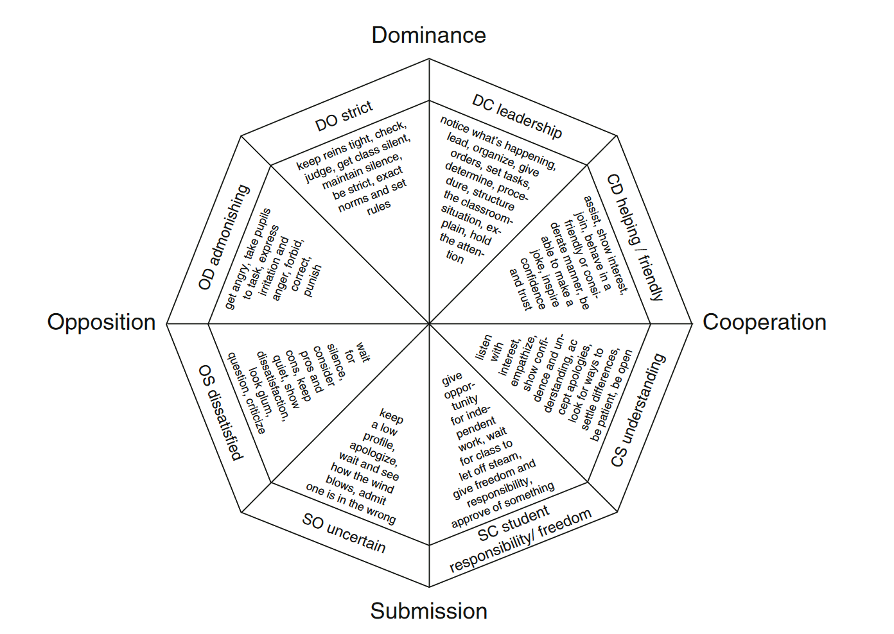

Teacher–Students Relationships in the Classroom
===============================================

Wubbels, T., Brekelmans, M., den Brok, P., Wijsman, L., Mainhard, T., & van Tartwijk, J. (2014) Teacher-student relationships and classroom management. In E. T. Emmer, E. Sabornie, C. Evertson, & C. Weinstein (Eds.). Handbook of classroom management: Research, practice, and contemporary issues (2nd ed., pp. 363–386). New York, NY: Routledge.
https://www.routledgehandbooks.com/doi/10.4324/9780203074114.ch19
https://doi.org/10.4324/9781003275312 3rd edition
* 

* [Teacher–Students Relationships in the Classroom](https://faculty.ksu.edu.sa/sites/default/files/teacher-students_relationships_in_the_classroom.pdf) Theo Wubbels and Mieke Brekelmans
    * My Summary:
        * Some well made points, but nothing revolutionary. As teachers we 'know' all of this. 
        * If students resonate with the teacher, they perform better.
        * Lecturing does not work. Constructivist tasks take more teacher skill. Shouting does not work. High expectations good.
        * Relationships are reciprocal - good teacher good class - bad teacher bad class. Teachers facing a difficult class should look at themselves.
    * Intro
        * teacher/student interaction is 
            * predictor of student achievement, but also it is related to such factors as teacher job satisfaction and teacher burnout
            *  prevent discipline problems, 
            *  foster professional development
        * > if teachers ignore students’ questions because they do not hear them, then students might infer that the teacher is too busy, thinks that the students are too dull to understand, or considers the questions to be impertinent.
        > The message that students take from the teacher’s inattention can be different from the teacher’s intention, because there is no ultimately shared, agreed-upon system for attaching meaning
    * Teaching Styles
        * 
        * Questionnaire on Teacher Interaction (QTI)
            * Fisher (2002) developed the Teacher Communication Behaviour Questionnaire consisting of five scales: Challenging, Encouragement and Praise, Non-Verbal Support, Understanding and Friendly, and Controlling
        * Student–Teacher Relationship Scale (STRS). 
            * 28 items rated on a five-point Likert-type scale and contains three sub-scales that measure Conflict, Closeness, and Dependency
        * three communication styles in science education. 
            * Problem solvers
                * are teachers who ask relatively many questions and emphasise problems, hypotheses and experimental procedures. 
            * Informers 
                * are characterised by infrequent use of questions except those demanding recall and the application of facts and principles to problem solving. 
            * Enquirers
                * students initiate interactions more often than in the other classrooms, and they particularly seek information and guidance in designing experimental procedures and in inferring, formulating and testing hypotheses.
    * Teaching Styles and Student Outcomes
        * how do these communication styles relate to student outcomes?
        * formal teaching style(, with emphasis on external motivation, no choice for students, structured teaching and seatwork with good teacher monitoring and frequent evaluation,) was more effective than informal teaching (characterised by choice for students, little emphasis on evaluation and control and integration of subjects)
        * person-oriented leadership style, more so than a task-oriented style, was favourable for student achievement.
        * the three teaching styles did not differ in student performance for below-average students.
            * The enquirer style, more so than the other styles, seemed to help low-ability students to enjoy science. 
            * The informer style generally was the least effective, particularly for affective outcomes. 
            * The problem-solver style was most effective for high-ability students’ performance in physics
        * studies could have overestimated the influence of teaching on student learning.
        * medium to strong relations between student outcomes and student perceptions of teacher–students relationships. The relations are stronger for affective than for cognitive outcomes
        * student perceptions of leadership, helpful/friendly and understanding behaviours are positively related to both student attitudes and student achievement.
        * teachers using open teaching styles are able to control student input and procedures in class so as to avoid disorder.
        * the relationship will be bi-directional, with negative and positive circular processes between teacher behaviour, classroom atmosphere and student outcomes occurring
    * Non-verbal
        * when teachers raise their voices, this contributes to an oppositional rating of their behaviour.
    * Instructional Strategies
        * as teachers communicate uncertainty, anger, impatience and dissatisfaction, they display fewer instructional strategies associated with effectiveness.
    * Teacher experience
        * teachers with about 6–10 years of experience have the best relationships with their students in terms of promoting student achievement and positive attitudes
        * (from conclusion)
            * Middle-aged teachers should be aware of potential detrimental effects on the classroom atmosphere of lower levels of cooperative teacher behaviour (to much "My-way or the highway")
            * Beginning science teachers should focus their attention on their leadership behaviour
    * Teacher Cognition
        * The more positively teachers think about their potential to influence student outcomes, the more they achieve a positive classroom atmosphere in their teaching
        * Teachers with a high anxiety level behave in a dogmatic and authoritarian way and lack flexibility.
        *  the relationships are reciprocal. That is, a good classroom atmosphere will give teachers a high regard of their competence to help students to learn and also this self-perception will help teachers to create good relationships.
        * patters
            *  ego-enhancing pattern, 
                *  teachers attribute student success to their own teaching behaviour and student failure to student characteristics such as low ability or low effort. 
            *  counter-defensive pattern, 
                *  low student outcomes are explained, for example, by a teacher’s failure to explain things clearly and students are given credit for their success
            *  In the second pattern more than in the first, the teacher will be inclined to help students and to explain difficult material again, to interact with students in order to explore their mistakes, etc
        *  prophecy become reality
            *  Teachers who have low expectations of some students, for example, tend to direct more lower-level questions to these students and more higher-order questions to students with high ability. This could stimulate high-ability students to develop more and more quickly than low-ability students, thus reinforcing teacher perceptions of students and making the prophecy become reality.
            *  When teachers think that students cannot bear much responsibility, they might tend to give limited responsibility to students. For example, they could organise experiences rigidly and give students little opportunity for choice of subject and methods of working. Thus students have to rely on the teacher very much during their activities
        * Setting
            * short physical distance and eye contact are important for helping teachers to convey to students interest, support and involvement, which are important characteristics of effective teachers
            *  It is important to arrange seating in such a way that as few students as possible are sitting behind each other and so that the teacher can move freely between the students.
        *  School Environment
            * teachers believe they have considerable freedom to shape their own classroom regardless of the school atmosphere.
        * Conclusions
            * Teachers can use several student questionnaires (general ones, as well as ones specifically for science education) to gather feedback about their relationships with students, as a basis for reflection and improvement of these relationships. It is important not to rely solely on teacher perceptions because usually the teacher’s and students’ perceptions differ widely.
            * A good beginning of the school year is essential. 
            * Teachers experiencing undesirable classroom situations should focus on their own behaviour as a means for improvement.
